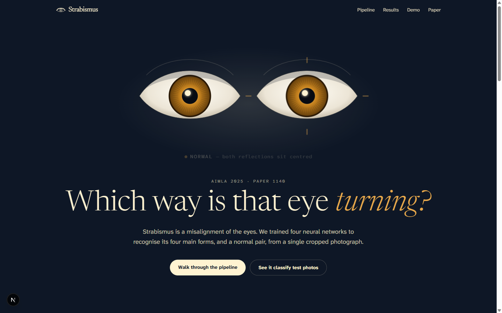

# Strabismus Classifier

Deep learning framework that classifies strabismus (ocular misalignment) from eye/face photos into five categories, benchmarking four CNN architectures to find the most accurate one.




## Website

**[strabismus.madhavarora.com](https://strabismus.madhavarora.com)** (launching soon) walks through the whole pipeline interactively. Every box in the paper's flowchart opens its own page: the real images at each step, the models and their published results, and a demo gallery of test-set predictions. The site lives in [`web/`](web/).

## Problem

Strabismus affects depth perception, reading, and driving, and can cause lasting visual impairment (amblyopia) if untreated. Clinical diagnosis today relies on manual tests (the Hirschberg test, cover test, prism evaluation) that require specialist expertise and don't scale well, especially in resource-limited settings.

This project builds an automated, quantitative classifier that sorts a photo into one of five categories — **Esotropia, Exotropia, Hypertropia, Hypotropia, or Normal** alignment — as a step toward a scalable screening aid for ophthalmologists.

## Approach

A five-stage pipeline, each stage its own notebook:

1. **Denoise + resize** raw images (Non-local Means denoising, aspect-ratio-preserving resize)
2. **Split** into train/val/test (70/15/15)
3. **Augment** the training split only (flip, brightness, contrast, grayscale — 10x expansion), to avoid leaking near-duplicates into validation/test
4. **Train** four independent models — a from-scratch AlexNet-style CNN, and transfer-learned VGG19, ResNet50, and EfficientNetB7 — each with class-weighted loss to handle the mild class imbalance
5. **Evaluate** on a held-out test set with accuracy, precision, recall, F1, and confusion matrices

A fifth model (a Vision Transformer) was attempted but never trained due to a hard dependency conflict — see [Known Limitations](#known-limitations).

## Results

Published results, from our paper (`paper/paper.pdf`):

| Model | Accuracy | Precision | Recall | F1 Score |
|---|---|---|---|---|
| AlexNet (from scratch) | 59.26% | 58.88% | 59.26% | 58.71% |
| VGG19 (transfer learning) | 66.67% | 67.45% | 66.67% | 67.00% |
| ResNet50 (transfer learning) | 74.00% | 79.00% | 73.00% | 74.00% |
| **EfficientNetB7 (transfer learning)** | **84.00%** | **85.00%** | **83.00%** | **84.40%** |

EfficientNetB7 is the clear winner. Note: there's no fixed random seed anywhere in the pipeline, so re-running the notebooks in this repo will not reproduce these exact numbers — see `prep/deepdive.md` for a documented case where a saved notebook run differs from the published figures.

## Status

- The paper was presented at **AIMLA 2025** (see `paper/aimla_2025_certificate.pdf`).
- The four models are being retrained with fixed seeds (3 seeds each, reproducing the notebooks exactly and also with known bugs corrected) using the scripts in [`training/`](training/). Weights will be published once the runs finish.
- The website is built; its demo gallery shows placeholder predictions until the retrained model's outputs are imported.

## Tech Stack

- **Models:** Python, TensorFlow/Keras, OpenCV, `albumentations`, scikit-learn. The original runs used a local NVIDIA RTX 3070 Ti and Google Colab; retraining runs on 8× A100.
- **Website:** Next.js 16 (App Router, statically generated), React view transitions, Tailwind CSS v4, deployed on Vercel.

## Repository Structure

```
notebooks/
├── pipeline/     # denoise/resize → split → augment
├── models/       # the 4 working models + the incomplete ViT attempt
└── archive/      # earlier draft notebooks, kept for history
training/         # seeded retraining scripts (see training/prompt.md for the server runbook)
web/              # the website (Next.js)
data/             # dataset folders, gitignored — download link in data/README.md
paper/            # paper draft text, published PDF, presentation, conference certificate
assets/           # README images
```

## Setup

```bash
pip install -r requirements.txt
```

Dependency versions are inferred from the notebooks' imports (no environment file survived from the original project) — see `requirements.txt` for the caveat on exact pinning.

## Data

The 517 photos were handpicked from open-source sites, cropped to the eyes and labelled in CVAT. They are available for research use on [Google Drive](https://drive.google.com/drive/folders/1pU6S3G0Rm6ZIIHgLfFS3Q_aARTXCGxxk) rather than in this repo; if a photo is yours and you want it removed, open an issue. See [`data/README.md`](data/README.md) for the folder layout.

**Before running any notebook**, update its hardcoded dataset paths — they currently point at the original development machines (`E:/Projects/Strabismus/...` locally, `/content/drive/MyDrive/Strabismus_New/...` on Colab).

## Known Limitations

- No trained model weights saved from the original runs (retraining in progress, see [Status](#status))
- No fixed random seed in the original notebooks — split and training results vary run to run (the retraining scripts fix this)
- The Vision Transformer attempt (`notebooks/models/vit_b16_attempt.ipynb`) never trained — it requires TensorFlow ≥2.11, and this project is pinned to 2.10.0
- A MobileNetV2 transfer-learning attempt (`notebooks/models/mobilenetv2_transfer.ipynb`) crashed on a GPU/cuDNN error partway through training and was never retried

See `prep/deepdive.md` (not published — personal study notes) for a full code-level breakdown.

## License

[MIT](LICENSE)

## Authors

- Madhav Arora — [madhavarora.com](https://madhavarora.com)
- Bhumit Gupta
- Shubh Garg

Advised by Dr. Debabrata Ghosh, Thapar Institute of Engineering & Technology (TIET), Patiala.

Equal contribution among the three student authors.
